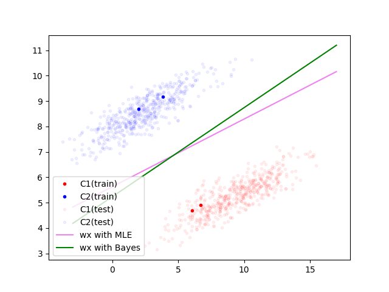
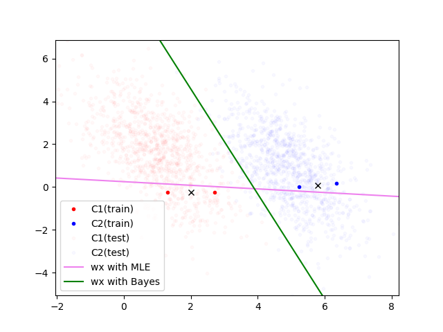
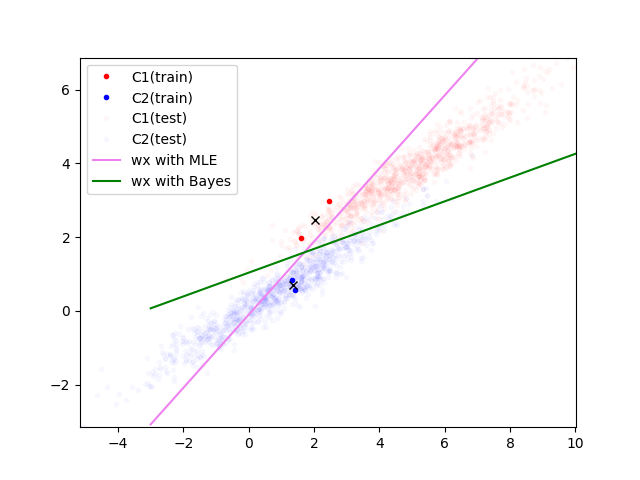
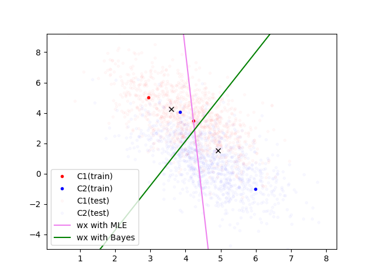
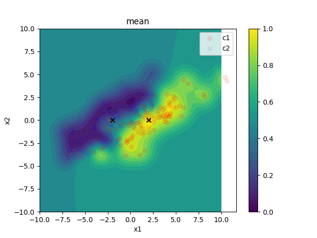
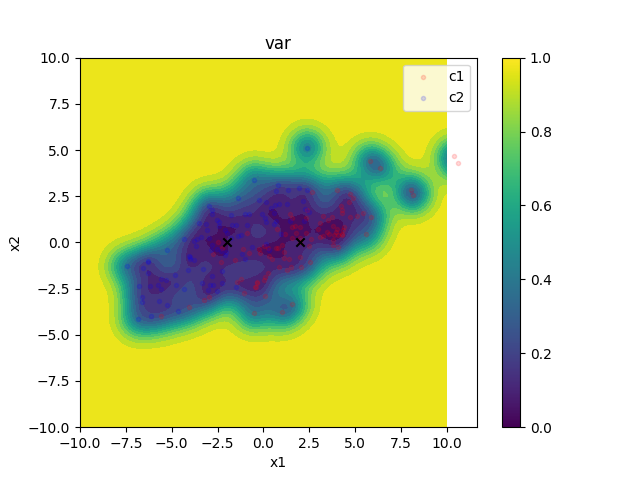

# **Bayesian Fisher Discriminant Analysis**

Bayesian approach for FDA.

## **⚠️ Notice**

This document is fork(+translation) of report for 'Machine Learning Algorithms' class in Hanyang Univ., Korea.  The original(Korean) report pdf file and tex file included.

## **Author**

Sungmin Yoo

Heesung Kim

---

## **Description about FDA**

FDA(Fisher Discriminant Analysis) is one of the classification algorithms, which finds a vector $\bf w$ that makes *between-class* covariance bigger and *within-class* covariance smaller.

### **Loss Function**

Let two mutually exclusive classes be ${\cal C}_1$, ${\cal C}_2$, and the number of each class be $N_1, N_2$. For the data ${\bf x}_n \in \mathbb{R}^D$, mean and covariance of each class are as follows:

```math
\begin{equation}
\begin{aligned}
	\boldsymbol{\mu}_1 &= \frac{1}{N_1}\sum_{n \in {\cal C}_1} {\bf x}_n \\
	\boldsymbol{\mu}_2 &= \frac{1}{N_2}\sum_{n \in {\cal C}_2} {\bf x}_n \\
	\Sigma_1 &= \frac{1}{N_1} \sum_{n \in {\cal C}_1} ({\bf x}_n - \boldsymbol{\mu}_1)({\bf x}_n - \boldsymbol{\mu}_1)^\top \\
	\Sigma_2 &= \frac{1}{N_2} \sum_{n \in {\cal C}_2} ({\bf x}_n - \boldsymbol{\mu}_2)({\bf x}_n - \boldsymbol{\mu}_2)^\top
\end{aligned}
\tag{1}
\end{equation}
```

With the number of whole data $N = N_1 + N_2$, the mean of whole data is as follows:

```math
\begin{equation}
\begin{aligned}
	\boldsymbol{\mu} &= \frac{1}{N} \sum_{n =1}^N {\bf x}_n \\
	&= \frac{1}{N} (N_1 \boldsymbol{\mu}_1 + N_2 \boldsymbol{\mu}_2)
\end{aligned}
\tag{2}
\end{equation}
```

Introduce target $t_n$ 

```math
\begin{equation}
t_n = 
\begin{cases}
	\dfrac{N}{N_1} & (n \in {\cal C}_1) \\\\
	-\dfrac{N}{N_2} & (n \in {\cal C}_2)
\end{cases}
\tag{3}
\end{equation}
```

So, $\sum_n t_n = 0$. This can be interpreted as setting the average to 0 by weighting the class label.

Then, the Loss function is

```math
\begin{equation}
	L = \frac{1}{2} \sum_{n = 1}^N ({\bf w}^\top {\bf x}_n + w_0 - t_n)^2
	\tag{4}
\end{equation}
```

(Duda and Hart, 1973)

If the data ${\bf x}_n$ are centralized (${\bf x}_n \leftarrow {\bf x}_n - \boldsymbol{\mu}$), the new mean is $\boldsymbol{\mu} = 0$ and the bias term becomes $w_0 = - {\bf w}^\top \boldsymbol{\mu} = 0$, which make the loss function simpler:


```math
\begin{equation} 
	L = \frac{1}{2} \sum_{n = 1}^N ({\bf w}^\top {\bf x}_n - t_n)^2 
	\tag{5}
\end{equation}
```

## **Bayesian Approach**

### **Likelihood**

Without loss of generality, assume that all data have been centralized. Then, we can construct **likelihood** similar to equation (5).

```math
\begin{equation}
\begin{aligned}
	p(t | {\bf x}, {\bf w}) &= {\cal N} (t | {\bf w}^\top {\bf x}, \sigma^2) \\
	&= \frac{1}{\sqrt{2 \pi \sigma^2}} \exp \left(-\frac{1}{2 \sigma^2} ({\bf w}^\top {\bf x} - t)^2 \right)
\end{aligned}
\tag{6}
\end{equation}
```

### **Prior**

The prior distribution of parameter $\bf w$ is

```math
\begin{equation}
\begin{aligned}
	p({\bf w}) &= {\cal N} ({\bf w} | {\bf 0}, \sigma_{\bf w}^2 {\bf I})
\end{aligned}
\tag{7}
\end{equation}
```

### **Posterior**

Posterior distribution $p({\bf w} | {\cal D})$ can be calculated with Bayes' rule:

```math
\begin{equation}
\begin{aligned}
	p({\bf w} | {\cal D}) &= p({\bf w}) p({\cal D} | {\bf w}) \\
	&= \prod_{n = 1}^N p({\bf w}) p(t_n | {\bf x}_n, {\bf w}) \\
	&= C ~ \exp( ① )
\end{aligned}
\tag{8}
\end{equation}
```

As both likelihood and prior are gaussian, posterior is also gaussian. So, expanding only inside of $\exp$ is enough.

```math
\begin{equation*}
\begin{aligned}
	① &= -\frac{1}{2\sigma^2}  \left( \sum_{n = 1}^N \left(  {\bf w}^\top{\bf x}_n{\bf x}_n^\top{\bf w} - 2 t_n {\bf w}^\top {\bf x}_n + t_n^2 \right) + \frac{\sigma^2}{\sigma_{\bf w} ^2} {\bf w}^\top {\bf w}  \right)
	\\
	&= -\frac{1}{2\sigma^2}  \left( \sum_{n \in {\cal C}_1} \left(  {\bf w}^\top{\bf x}_n{\bf x}_n^\top{\bf w} - 2 \frac{N}{N_1} {\bf w}^\top {\bf x}_n + \frac{N^2}{N_1^2} \right) + \sum_{n \in {\cal C}_2} \left(  {\bf w}^\top{\bf x}_n{\bf x}_n^\top{\bf w} + 2 \frac{N}{N_2} {\bf w}^\top {\bf x}_n + \frac{N^2}{N_2^2} \right) + \frac{\sigma^2}{\sigma_{\bf w} ^2} {\bf w}^\top {\bf w}  \right)
	\\
	&= -\frac{1}{2\sigma^2} \left(
		{\bf w}^\top \left(
			\sum_{n \in {\cal C}_1}{\bf x}_n {\bf x}_n^\top + \sum_{n \in {\cal C}_2}{\bf x}_n {\bf x}_n^\top + \frac{\sigma^2}{\sigma_{\bf w}^2} {\bf I}
		\right) {\bf w} - 2N{\bf w}^\top(\boldsymbol{\mu}_1 - \boldsymbol{\mu}_2)
	 \right) + C
\end{aligned} 
\tag{9}
\end{equation*}
```

Introduce *within-class* covariance $`{\bf S}_{\rm W}`$ and *between-class* covariance $`{\bf S}_{\rm B}`$

```math
\begin{equation}
\begin{aligned}
	{\bf S}_{\rm W} &= \sum_{n \in {\cal C}_1} ({\bf x}_n - \boldsymbol{\mu}_1) ({\bf x}_n - \boldsymbol{\mu}_1)^\top +  \sum_{n \in {\cal C}_2} ({\bf x}_n - \boldsymbol{\mu}_2) ({\bf x}_n - \boldsymbol{\mu}_2)^\top \\
	{\bf S}_{\rm B} &= (\boldsymbol{\mu}_1 - \boldsymbol{\mu}_2)(\boldsymbol{\mu}_1 - \boldsymbol{\mu}_2)^\top
\end{aligned}
\tag{10}
\end{equation}
```

which let

```math
\begin{equation}
\begin{aligned}
	\sum_{n = 1}^N {\bf x}_n {\bf x}_n ^\top &= \sum_{n \in {\cal C}_1} {\bf x}_n {\bf x}_n^\top + \sum_{n \in {\cal C}_2} {\bf x}_n {\bf x}_n^\top \\
	&= {\bf S}_{\rm W} + N_1 \boldsymbol{\mu}_1 \boldsymbol{\mu}_1^\top + N_2 \boldsymbol{\mu}_2 \boldsymbol{\mu}_2^\top \\
	&= {\bf S}_{\rm W} + \frac{N_1 N_2}{N} {\bf S}_{\rm B} 
\end{aligned}
\tag{11}
\end{equation}
```

So, $①$ is

```math
\begin{equation}
\begin{aligned}
	① &= -\frac{1}{2\sigma^2} \left(
		{\bf w}^\top \left( {\bf S}_{\rm W} + \frac{N_1 N_2}{N} {\bf S}_{\rm B} + \frac{\sigma^2}{\sigma_{\bf w}^2}{\bf I} \right)
		{\bf w} - 2N{\bf w}^\top (\boldsymbol{\mu}_1 - \boldsymbol{\mu}_2)
	\right)  + C 
	\\\\
	&= -\frac{1}{2} ({\bf w} - \boldsymbol{\mu}_{{\bf w}|{\cal D}})^\top \Sigma_{{\bf w}|{\cal D}}^{-1} ({\bf w} - \boldsymbol{\mu}_{{\bf w}|{\cal D}}) + C
\end{aligned}
\tag{12}
\end{equation}
```

And the posterior $p({\bf w} | {\cal D})$ is

```math
\begin{equation}
	p({\bf w} | {\cal D}) = {\cal N} (\boldsymbol{\mu}_{{\bf w}|{\cal D}}, \Sigma_{{\bf w}|{\cal D}})
	\tag{13}
\end{equation}
```

where

```math
\begin{equation}
\begin{aligned}
	\boldsymbol{\mu}_{{\bf w} | {\cal D}} &= N \left( {\bf S}_{\rm W} + \frac{N_1 N_2}{N} {\bf S}_{\rm B} + \frac{\sigma^2}{\sigma_{\bf w}^2}{\bf I} \right)^{-1} (\boldsymbol{\mu}_1 - \boldsymbol{\mu}_2)
	\\
	\Sigma_{{\bf w} | {\cal D}} &= \sigma^2 \left( {\bf S}_{\rm W} + \frac{N_1 N_2}{N} {\bf S}_{\rm B} + \frac{\sigma^2}{\sigma_{\bf w}^2}{\bf I} \right)^{-1}
\end{aligned}
\tag{14}
\end{equation}
```

### **Predictive Distribution**

The predictive distribution $p(t | {\bf x}, {\cal D})$ is the integral of product of likelihood and posterior for a new data ${\bf x}$. 

```math
\begin{equation}
	p(t | {\bf x}, {\cal D}) = \int _{\cal W} p(t | {\bf x}, {\bf w}) p({\bf w} | {\cal D}) {~\rm d{\bf w}}
	\tag{15}
\end{equation}
```

Also this is a gaussian, consider inside of $`\exp`$ only. Because the result of integration with respect to $\bf w$ is the probability distribution with respect to $t$, the inside-$`\exp`$ term can be simplified as follows:

```math
\begin{equation*}
\begin{aligned}
	&-\frac{1}{2 \sigma^2} \left(
		{\bf w}^\top \left( {\bf S}_{\rm W} + \frac{N_1 N_2}{N} {\bf S}_{\rm B} + \frac{\sigma^2}{\sigma_{\bf w}^2}{\bf I} \right)
		{\bf w} - 2N{\bf w}^\top (\boldsymbol{\mu}_1 - \boldsymbol{\mu}_2) + ({\bf w}^\top {\bf x} - t)^2
	 \right) + \cdots 
	 \\
	 =& -\frac{1}{2 \sigma^2} \left(
	 {\bf w}^\top \underbrace{\left( {\bf x}{\bf x}^\top +  {\bf S}_{\rm W} + \frac{N_1 N_2}{N} {\bf S}_{\rm B} + \frac{\sigma^2}{\sigma_{\bf w}^2}{\bf I} \right)}_{\Delta}
	 {\bf w} - 2N{\bf w}^\top (\boldsymbol{\mu}_1 - \boldsymbol{\mu}_2 + t{\bf x}/N) + t^2
	 \right) + \cdots 
\end{aligned}
\tag{16}
\end{equation*}
```

Marginalizing out $\bf w$, the inside of $\exp$ term of distribution w.r.t. $t$ is 

```math
\begin{equation}
\begin{aligned}
	&-\frac{1}{2 \sigma^2} \left(
		(1 - {\bf x}^\top \Delta^{-1} {\bf x})t^2 - 2N {\bf x}^\top \Delta ^{-1} (\boldsymbol{\mu}_1 - \boldsymbol{\mu}_2)t
	\right) + \cdots
	\\\\
	=& \frac{(1 - {\bf x}^\top \Delta^{-1} {\bf x})}{2\sigma^2} \left(
		t - \frac{N{\bf x}^\top \Delta^{-1} (\boldsymbol{\mu}_1 - \boldsymbol{\mu}_2)}{(1 - {\bf x}^\top \Delta^{-1} {\bf x})}
	\right)^2
\end{aligned}
\tag{17}
\end{equation}
```

Therefore, the mean and variance of predictive distribution is as follows:

```math
\begin{equation}
\begin{aligned}
	\mathbb{E}[t | {\bf x}, {\cal D}] &= \cfrac{N {\bf x}^\top \left( {\bf x}{\bf x}^\top + {\bf S}_{\rm W} + \dfrac{N_1 N_2}{N} {\bf S}_{\rm B} + \dfrac{\sigma^2}{\sigma^2_{\bf w}} {\bf I}\right)^{-1}(\boldsymbol{\mu}_1 - \boldsymbol{\mu}_2)}{1 - {\bf x}^\top \left( {\bf x}{\bf x}^\top + {\bf S}_{\rm W} + \dfrac{N_1 N_2}{N} {\bf S}_{\rm B} + \dfrac{\sigma^2}{\sigma^2_{\bf w}} {\bf I}  \right)^{-1} {\bf x}}
	\\\\
	{\rm Var}[t | {\bf x}, {\cal D}] &= \cfrac{\sigma^2}{1 - {\bf x}^\top \left( {\bf x}{\bf x}^\top + {\bf S}_{\rm W} + \dfrac{N_1 N_2}{N} {\bf S}_{\rm B} + \dfrac{\sigma^2}{\sigma^2_{\bf w}} {\bf I}  \right)^{-1} {\bf x}}
\end{aligned}
\tag{18}
\end{equation}
```

Introduce matrix ${\bf X}$ such that

```math
\begin{equation}
	{\bf X} = \begin{pmatrix}
		\vert & & \vert \\
		{\bf x}_1 & \cdots & {\bf x}_N \\
		\vert & & \vert
	\end{pmatrix} \in \mathbb{R}^{D \times N}
	\tag{19}
\end{equation}
```

Then,

```math
\begin{equation}
\begin{aligned}
	\sum_{n=1}^N {\bf x}_n {\bf x}_n^\top &= {\bf S}_{\rm W} + \frac{N_1 N_2}{N} {\bf S}_{\rm B}  \\
	&= {\bf X}{\bf X}^\top
\end{aligned}
\tag{20}
\end{equation}
```

So, equation (18) can be simplified as follows:

```math
\begin{equation}
\begin{aligned}
	\mathbb{E}[t | {\bf x}, {\cal D}] &= \cfrac{N {\bf x}^\top \left( {\bf x}{\bf x}^\top + {\bf X}{\bf X}^\top + \dfrac{\sigma^2}{\sigma^2_{\bf w}} {\bf I}\right)^{-1}(\boldsymbol{\mu}_1 - \boldsymbol{\mu}_2)}{1 - {\bf x}^\top \left( {\bf x}{\bf x}^\top + {\bf X}{\bf X}^\top + \dfrac{\sigma^2}{\sigma^2_{\bf w}} {\bf I}  \right)^{-1} {\bf x}}
	\\\\
	{\rm Var}[t | {\bf x}, {\cal D}] &= \cfrac{\sigma^2}{1 - {\bf x}^\top \left( {\bf x}{\bf x}^\top + {\bf X}{\bf X}^\top + \dfrac{\sigma^2}{\sigma^2_{\bf w}} {\bf I}  \right)^{-1} {\bf x}}
\end{aligned}
\tag{21}
\end{equation}
```

In equation (19), the denominator of mean and variance is same. Simplify it by using Woodbury identity:

```math
\begin{align}
	({\rm denom}) &= \left(
		1 + {\bf x}^\top \left( 
			{\bf X}{\bf X}^\top + \frac{\sigma^2}{\sigma^2_{\bf w}} {\bf I}
		\right) ^{-1} {\bf x}
	\right) ^{-1} \tag{22} \\
	&= \left(
		1 + \frac{\sigma^2_{\bf w}}{\sigma^2} \left(
			{\bf x}^\top {\bf x} - {\bf x}^\top {\bf X} \left( 
				{\bf X}^\top{\bf X} + \frac{\sigma^2}{\sigma^2_{\bf w}}
			\right) {\bf X}^\top {\bf x}
		\right)
	\right) \tag{23}
\end{align}
```

Plugging-in equation (21) into variance:

```math
\begin{equation}
\begin{aligned}
	{\rm Var}[t | {\bf x}, {\cal D}] &= \sigma^2 + \sigma^2_{\bf w} {\bf x}^\top{\bf x} - \sigma^2_{\bf w} {\bf x}^\top {\bf X} \left( {\bf X}^\top{\bf X} + \frac{\sigma^2}{\sigma^2_{\bf w}} {\bf I} \right)^{-1} {\bf X}^\top {\bf x} \\
	&\ge \sigma^2
\end{aligned}
\tag{24}
\end{equation}
```

which means the variance of prediction cannot go under the aleatoric uncertainty $\sigma^2$.

Using Woodbury identity in numerator of mean:

```math
\begin{equation*}
\begin{aligned}
	({\rm num}) = N{\bf x}^\top \left(
		{\bf X}{\bf X}^\top + \dfrac{\sigma^2}{\sigma^2_{\bf w}} {\bf I}
	\right)^{-1} (\boldsymbol{\mu}_1 - \boldsymbol{\mu}_2) -
	\cfrac{N{\bf x} ^\top \left({\bf X}{\bf X}^\top + \dfrac{\sigma^2}{\sigma^2_{\bf w}} {\bf I} \right)^{-1} {\bf x}{\bf x}^\top \left({\bf X}{\bf X}^\top + \dfrac{\sigma^2}{\sigma^2_{\bf w}} {\bf I} \right)^{-1} (\boldsymbol{\mu}_1 - \boldsymbol{\mu}_2)}{1 + {\bf x}^\top \left({\bf X}{\bf X}^\top + \dfrac{\sigma^2}{\sigma^2_{\bf w}} {\bf I} \right)^{-1}{\bf x}}
\end{aligned}
\tag{25}
\end{equation*}
```

Plugging-in equation (22) into the denominator of mean, the mean can be simplified as follows:

```math
\begin{equation}
	\mathbb{E}[t | {\bf x}, {\cal D}] = N{\bf x}^\top \left(
	{\bf X}{\bf X}^\top + \dfrac{\sigma^2}{\sigma^2_{\bf w}} {\bf I}
	\right)^{-1} (\boldsymbol{\mu}_1 - \boldsymbol{\mu}_2)
	\tag{26}
\end{equation}
```

### **Result of Bayesian FDA**

<figure>

<figcaption align="center">(a): Well classified</figcaption>
</figure>

<br /><br />

<figure>

<figcaption align="center">(b): Good with Bayesian, Bad with MLE</figcaption>
</figure>

<br /><br />

<figure>

<figcaption align="center">(c): Good with Bayesian, Bad with MLE</figcaption>
</figure>

<br /><br />

<figure>

<figcaption align="center">(d): Slightly outlying training data</figcaption>
<br /><br />
<figcaption><b>Fig. 1 - Result of FDA with MLE & Bayesian</b></figcaption>
</figure>
</div>

<br /><br />

Figure 1 shows the result comparing $\bf w$ with MLE and Bayesian approach with $\sigma^2 / \sigma^2_{\bf w} = 0.1$. Bold dots are training data and light dots are testing data. The pink line is the boundary with MLE and the green one is with Bayesian approach. 

For extreme comparison between two methods, the number of training data is 2 for each class. 

Sometimes, both two methods classify well (Figure 1a) but Baysian is better than MLE for most case (Figure 1b, 1c). In detail, MLE gives **over-fitted** classifier while Bayesian do much less. This is because the prior variance acts as a regularization term.

Also, Bayesian showed better performance in the cases with outlying data (Figure 1d).

## **Kernel Extension**

Consider following mapping function $\phi$ such that

```math
\begin{equation}
	\phi: \mathbb{R}^D \to \mathbb{R}^M
	\tag{27}
\end{equation}
```

and mapped data $\phi({\bf x}) \in \mathbb{R}^M$. Then, the mean of mapped data is naturally defined:

```math
\begin{equation}
\begin{aligned}
	\boldsymbol{\mu}_1^\phi &= \frac{1}{N_1} \sum_{n \in {\cal C}_1} \phi({\bf x}_n) \\
	\boldsymbol{\mu}_2^\phi &= \frac{1}{N_2} \sum_{n \in {\cal C}_2} \phi({\bf x}_n)
\end{aligned}
\tag{28}
\end{equation}
```

If the mapped data centralized (or do centralize), the loss function is 

```math
\begin{equation}
	\frac{1}{2} \sum_{n = 1}^N ({\bf w}^\top \phi({\bf x}_n) - t_n)^2
	\tag{29}
\end{equation} 
```

Introduce matrices

```math
\begin{equation}
\begin{aligned}
	\boldsymbol{\Phi} &= \begin{pmatrix}
		| & & | \\
		\phi({\bf x}_1) & \cdots & \phi({\bf x}_N) \\
		| & & |
	\end{pmatrix} \in \mathbb{R}^{M \times N} \\\\
	{\bf t} &= (t_1, \cdots, t_N)^\top \in \mathbb{R}^{N}
\end{aligned}
\tag{30}
\end{equation}
```

For positive-definite function $k$, introduce matrices

```math
\begin{equation}
\begin{aligned}
	k({\bf x}_i, {\bf x}_j) &= \phi({\bf x}_i)^\top \phi({\bf x}_j)
	\\\\
	{\bf K} &= \begin{pmatrix}
		k({\bf x}_1, {\bf x}_1) & \cdots & k({\bf x}_1, {\bf x}_N) \\
		\vdots & \ddots & \vdots \\
		k({\bf x}_N, {\bf x}_1) & \cdots & k({\bf x}_N, {\bf x}_N)
	\end{pmatrix} \\\\
	{\bf k} &= (k({\bf x}, {\bf x}_1), \cdots, k({\bf x}, {\bf x}_N))^\top 
\end{aligned}
\tag{31}
\end{equation}
```

Equation (26; predictive mean) can be written as follows:

```math
\begin{equation}
	\mathbb{E}[t | {\bf x}, {\cal D}] = {\bf x}^\top {\bf X} \left(
	{\bf X}^\top{\bf X} + \dfrac{\sigma^2}{\sigma^2_{\bf w}} {\bf I}
	\right)^{-1} {\bf t}
	\tag{32}
\end{equation}
```

The mean and variance of mapped data are as follows:

```math
\begin{equation}
\begin{aligned}
	\mathbb{E}[t | {\bf x}, {\cal D}] &= \phi({\bf x})^\top\boldsymbol{\Phi} \left(
	\boldsymbol{\Phi}^\top \boldsymbol{\Phi} + \dfrac{\sigma^2}{\sigma^2_{\bf w}} {\bf I}
	\right)^{-1} {\bf t}
	\\
	&=  {\bf k}^\top \left( {\bf K} + \frac{\sigma^2}{\sigma^2_{\bf w} } {\bf I} \right)^{-1} {\bf t} \\
	{\rm Var}[t | {\bf x}, {\cal D}] &= \sigma^2 + \sigma^2_{\bf w} \phi({\bf x})^\top\phi({\bf x}) - \sigma^2_{\bf w} \phi({\bf x})^\top \boldsymbol{\Phi} \left( \boldsymbol{\Phi}^\top\boldsymbol{\Phi} + \frac{\sigma^2}{\sigma^2_{\bf w}} {\bf I} \right)^{-1} \boldsymbol{\Phi}^\top \phi({\bf x}) \\
	&= \sigma^2 + \sigma^2_{\bf w} k({\bf x}, {\bf x}) - \sigma^2_{\bf w} {\bf k}^\top \left( {\bf K} + \frac{\sigma^2}{\sigma^2_{\bf w}} {\bf I} \right)^{-1} {\bf k}
\end{aligned}
\tag{33}
\end{equation}
```

This has same form to **Gaussian Process** with kernel vector $\bf k$ and kernel matrix $\bf K$ such that

```math
\begin{equation}
\begin{aligned}
	{\bf k}'_{i} &= \sigma^2_{{\bf w}} \phi({\bf x})^\top \phi({\bf x}_i) \\
	{\bf K}'_{ij} &= \sigma^2_{\bf w} \phi({\bf x}_i)^\top \phi({\bf x}_j) + \sigma^2 \delta_{ij}
\end{aligned}
\tag{34}
\end{equation}
```

### Result of kernel extended Bayesian FDA

<figure>

<figcaption align="center">(a): Mean of classifier</figcaption>
</figure>

<br /><br />

<figure>

<figcaption align="center">(b): Variance of classifier</figcaption>
<br /><br />
<figcaption><b>Fig. 2 - Result of Kernel-extended Bayesian FDA</b></figcaption>
</figure>

<br /><br />

Figure 2 shows the result of kernel extended Bayesian FDA, which is the classification with gaussian process. The kernel function is gaussian with regularization term from Bayesian approach.

Figure 2a shows that the data are well classified. It provides more complex and precise classifier than normal FDA which only gives a straight line. And also it is stable against outlying data or small data size because of regularization term. 

Figure 2b shows the variance of the classifier. The variance becomes smaller near the data and becomes bigger getting away from the data just as normal GP. Moreover, there is no point with severely low variance (=over-fitting) because of regularization term. 

## **References**

Bishop, C. M. (2006). *Pattern Recognition and Machine Learning*. New York :Springer.

Duda, R. O. and P. E. Hart (1973). Pattern Classification and Scene Analysis. Wiley.

